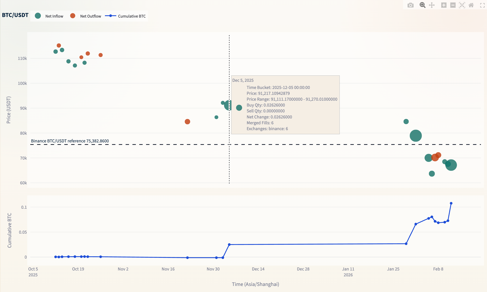

中文版移步： [README_CN.md](./README_CN.md)

# Crypto Trade Reviewer

<p></p>

[](https://github.com/user-attachments/assets/af9a9f46-c10e-49af-b5ec-99173ac01105)

Trade Review is a local, read-only visualization tool for historical spot fills across multiple exchanges.

The goal is simple: pull your real fills from different exchanges into one place so you can clearly see what you bought, what you sold, and how your position changed over time.

This project:

- is analysis-only
- does not place orders
- only imports executed fills
- can mix the same market across multiple exchanges
- keeps the chart focused on two parts:
  - top: net fill points
  - bottom: cumulative base-asset position line

## Supported Exchanges

- Binance Spot
- OKX Spot
- Bitget Spot
- Gate Spot

## Features

- English / Chinese UI
- browser timezone support
- Docker Compose deployment
- mixed multi-exchange market view
- live reference price line that follows the selected market

## Quick Start

```bash
cd ~/Documents/crypto-trade-reviewer
cp .env.example .env
docker compose up --build -d
```

Open:

```text
http://localhost:8513
```

Health check:

```bash
curl -sf http://localhost:8513/_stcore/health
```

## How To Use

1. Open the page.
2. Expand the exchange import section.
3. Choose an exchange tab.
4. Enter a read-only API key and secret.
5. Enter markets such as `BTCUSDT ETHUSDT SOLUSDT`.
6. Pick a date range.
7. Import fills.
8. Switch market and time interval in the main view.

## How To Read The Chart

Top chart:

- each point is the net result inside one time bucket
- point price is the merged average price for all fills in that bucket
- buys and sells are merged into one net point instead of two separate points
- larger points mean larger net base-asset movement
- the horizontal price line is the current reference price for the selected market

Bottom chart:

- shows cumulative base-asset quantity over time
- buys move it up
- sells move it down

## Where Data Is Stored

Project data is stored locally in:

```text
.data/trades.sqlite3
```

It stores:

- imported fill history
- exchange API form values entered in the UI

Important:

- data stays on your local machine
- API credentials are currently stored locally in plain text
- this is suitable for personal local use, not for shared machines

## Security Notes

- use read-only API keys only
- do not enable trading, withdrawal, or transfer permissions
- do not commit `.env`, `.data/`, database files, or screenshots with credentials

The repo already ignores sensitive local files such as:

- `.env`
- `.data/`
- `*.sqlite3`
- `secrets.toml`

## Common Commands

View logs:

```bash
docker compose logs -f
```

Restart:

```bash
docker compose restart
```

Stop:

```bash
docker compose down
```

## FAQ

### The page does not open

Check:

```bash
docker compose ps
curl -sf http://localhost:8513/_stcore/health
```

### Import finished but no data appears

This tool does not auto-fetch anything. You must import executed fills manually first.

### Very old fills are missing

Some exchanges limit how far back their official fill APIs can go. That limit comes from the exchange, not from this project.

## Local Development

```bash
cd ~/Documents/crypto-trade-reviewer
python3 -m venv .venv
source .venv/bin/activate
pip install -r requirements.txt
streamlit run app.py --server.address 0.0.0.0 --server.port 8513
```

Tests:

```bash
PYTEST_DISABLE_PLUGIN_AUTOLOAD=1 .venv/bin/pytest -q
.venv/bin/python -m compileall app.py src tests
```
